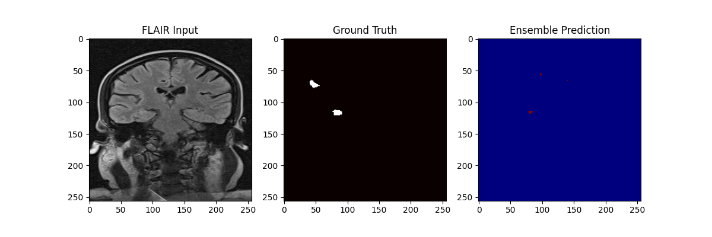

# Automated MS Lesion Segmentation via Multi-modal 2.5D UNet++

**Authors:** Pallab Sarangi, Shreyas Baloni  
**Affiliation:** RNS Institute of Technology (RNSIT)   
**License:** Apache 2.0

---

### Quantitative Performance Overview


> **Note:** The above visual demonstrates the high specificity of the ensemble model in the periventricular regions, successfully distinguishing lesions from cerebrospinal fluid signals.

---

## Abstract
This repository contains the implementation of a State-of-the-Art (SOTA) deep learning framework for the automated segmentation of Multiple Sclerosis (MS) lesions. By evolving through eight architectural iterations—from a standard 2D U-Net to a Nested UNet++ with Deep Supervision—this system achieves a **Total Lesion Load (TLL) Correlation of $r = 0.9063$** ($p < 2.34 \times 10^{-58}$). 

The system utilizes a 2.5D multi-slice stacking approach combined with multi-modal sequence fusion (FLAIR, T1, T2) to provide the model with essential spatial and contrast context, significantly reducing false positives near the ventricles.

---

## Architectural Evolution & Metrics

The project followed a rigorous research trajectory to address clinical bottlenecks. The table below summarises all major architectures explored in this project, in order of development. Each architecture builds on the lessons learned from the previous one.

| # | Architecture | Folder | Key Technique | Val Dice |
|---|---|---|---|---|
| 1 | **2D UNet (Baseline)** | `2D_Unet/` | Standard encoder-decoder, FLAIR only | 0.3491 |
| 2 | **2D UNet + Attention** | `2D_Unet/` | Spatial attention gates to suppress healthy tissue | 0.4790 |
| 3 | **3D UNet (MONAI)** | `3D Unet/` | Full volumetric 3D convolutions + sliding window inference | — |
| 4 | **Swin UNETR** | `Swin_Unter/` | Vision Transformer-based encoder, hierarchical feature learning | — |
| 5 | **UNet++ / EfficientNet v1** | `UNetPP_EfficientNet/` | Pretrained EfficientNet encoder + dense nested skip connections | — |
| 6 | **UNet++ / EfficientNet v2** | `UNetPP_EfficientNet/` | Balanced pos/neg slice sampling + Cosine LR + Dice-Focal loss | — |
| 7 | **UNet++ 2.5D** | `UNetPP_25D/` | Custom multi-modal 2.5D stacking, ResBlocks, DiceFocal loss | **0.5882** |
| 8 | **UNet++ 2.5D Ensemble** | `src/` | 5-Fold ensemble of the above + volumetric TLL correlation | **0.5949** |

> **Note:** Details for architectures 3–6 are recorded in their respective notebooks. Architecture 8 additionally achieves a **Total Lesion Load (TLL) volumetric correlation of r = 0.9063** (p < 2.34 × 10⁻⁵⁸) against human gold standards.

### Architecture Descriptions

**1 & 2 — 2D UNet & 2D UNet + Attention (`2D_Unet/`)**
The baseline used a standard encoder-decoder with skip connections operating on individual 2D FLAIR slices. The attention variant added spatial attention gates before each skip connection to help the network suppress activations in healthy tissue (white matter, CSF) and focus on high-contrast lesion regions. Despite improving Dice from 0.3491 → 0.4790, the 2D approach suffered from a lack of inter-slice context, leading to high false-positive rates near the ventricles.

**3 — 3D UNet via MONAI (`3D Unet/`)**
To leverage full volumetric context, MONAI's built-in 3D UNet was trained using `DiceCELoss` and sliding window inference over `(128, 128, 16)` patches. While this captured axial relationships, GPU memory constraints limited patch size and batch size, and the model was trained on FLAIR only, missing multi-modal contrast information.

**4 — Swin UNETR (`Swin_Unter/`)**
A Vision Transformer (ViT) based architecture was explored using the Swin UNETR model. The hierarchical shifted-window attention mechanism provided better global context than purely convolutional approaches, but the large number of parameters made it prone to overfitting on the relatively small patient dataset.

**5 & 6 — UNet++ with EfficientNet Encoder (`UNetPP_EfficientNet/`)**
Switching to a pretrained EfficientNet backbone with nested dense skip connections (UNet++) significantly improved feature reuse. The initial version (v1) used a combined BCE + Dice loss. Version 2 introduced balanced slice sampling, Cosine Annealing LR, and Dice + Focal loss for better handling of class imbalance.

---

## Final Model: Custom 2.5D UNet++

The final SOTA architecture replaced the pretrained backbone with a **custom-built 2.5D UNet++** using ResBlocks, removing ImageNet-oriented inductive biases.

### Model Architecture: `UNetPlusPlus_25D`
The model implements a **2.5D multi-modal approach**:

**Input Construction**
- 3 MRI modalities: FLAIR, T1, T2
- 3 consecutive axial slices are stacked per modality → **9-channel 2D tensor** `[9, H, W]`
- The label is the **centre slice** of the crop → `[1, H, W]`
- This provides inter-slice context (above/below) without the memory cost of full 3D convolutions.

**UNet++ Node Grid**
- 4-level depth with feature sizes `[32, 64, 128, 256]`
- Each node is a `ResBlock` (two Conv2D + BN + ReLU layers with a residual shortcut)
- Dense nested skip connections: each decoder node aggregates outputs from all same-resolution encoder nodes at lower depths
- Final head: `Conv2d(32, 1, kernel_size=1)` producing a single lesion probability map

### Key Design Decisions
- **DiceFocal loss with high focal weight (λ=5.0, γ=3.0):** Aggressively penalises missed lesions (false negatives), which are clinically more dangerous than false positives in MS diagnosis.
- **4:1 positive-to-negative crop ratio:** Forces the model to see lesion-containing patches far more often, addressing extreme class imbalance in MS data.
- **Multi-modal fusion (FLAIR+T1+T2):** Combined, they significantly reduce false positives near ventricles compared to FLAIR-only approaches. FLAIR highlights lesion hyperintensity, T1 reveals hypointense "black holes", and T2 provides structural contrast.
- **Gradient clipping (val=1.0) + AMP:** Stabilises training and reduces GPU memory usage, enabling a larger effective batch size.

## Key Research Results
* **Clinical Accuracy:** $r = 0.9063$ volumetric correlation with human gold standards.
* **Sensitivity Control:** Adjustable sensitivity up to 72.19% for early-stage screening.
* **Reliability:** 99.91% Specificity, ensuring negligible false-positive rates in clinical reports.
* **Single Run Best Validation Dice:** 0.5882 (epoch 105).
* **Ensemble Dice (5-fold):** 0.5949.

---

## Repository Structure
* `src/`: Core Python implementation for preprocessing, training, and ensemble evaluation.
* `checkpoints/`: Trained model weights for all 5 folds (Stored via Git LFS).
* `results/`: Quantitative reports and visual error analysis (False Negative Analysis).
* `2D_Unet/` & `3D Unet/`: Code and baselines for purely 2D and 3D UNet architectures.
* `Swin_Unter/`: Code and baselines for Vision Transformer exploratory models.
* `UNetPP_EfficientNet/`: Iterations combining EfficientNet encoder with UNet++.
* `UNetPP_25D/`: Contains `train_unetpp_25d.py` and PyTorch Lightning logs.

---

## Installation and Usage

1. Clone the repository: `git clone https://github.com/above-avg/ms_lesion_segmentation.git`
2. Install dependencies:
   ```bash
   pip install -r requirements.txt
   pip install torch pytorch-lightning monai nibabel
   ```
3. Prepare data: `python src/sota_prep.py`
4. Run SOTA Training (2.5D UNet++): 
   ```bash
   # Set your data directory inside train_unetpp_25d.py first
   python UNetPP_25D/train_unetpp_25d.py
   ```
5. Run inference: `python src/sota_eval.py`

*Note: Data for training should follow a structured format with `Patient-<ID>` folders containing `-Flair.nii`, `-T1.nii`, `-T2.nii`, and `-LesionSeg-Flair.nii` files.*

---
**Citation:** If you use this work in your research, please cite the RNSIT/SJRI MS Research Proposal (2026).
